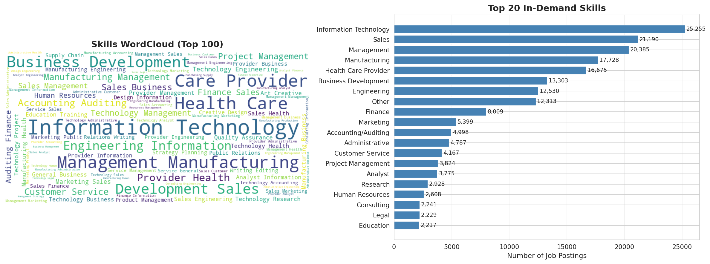
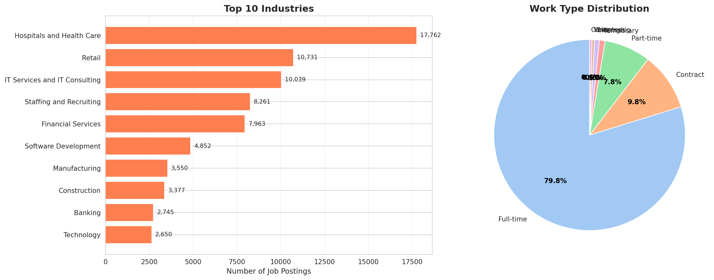
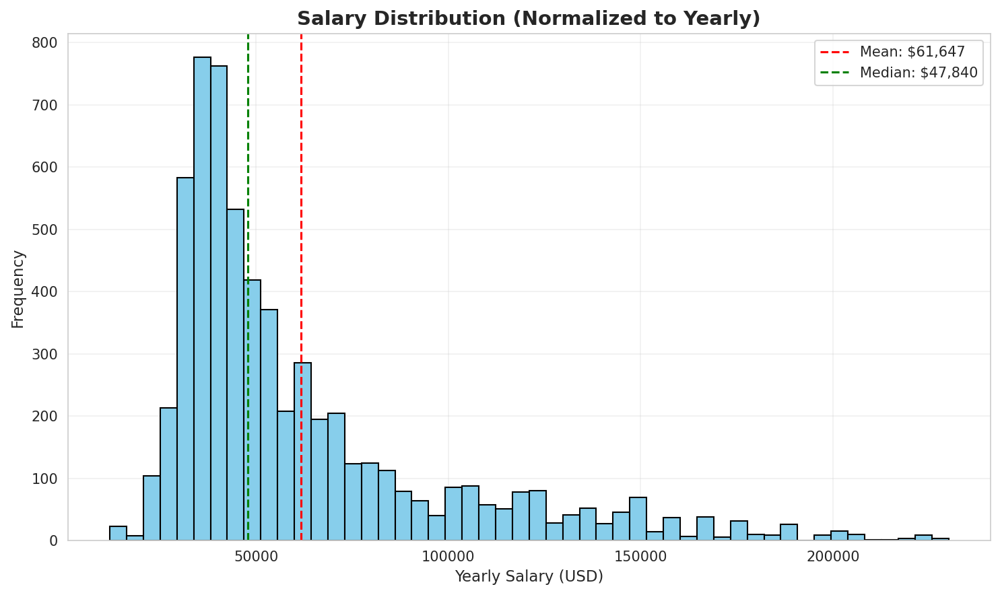
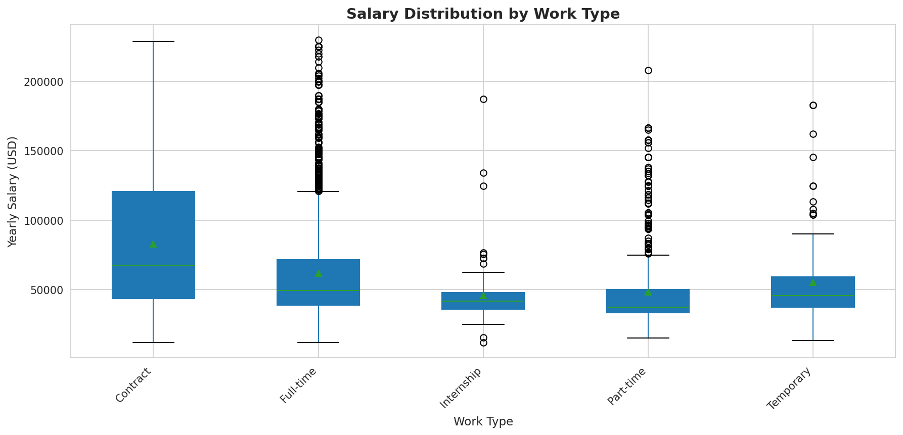
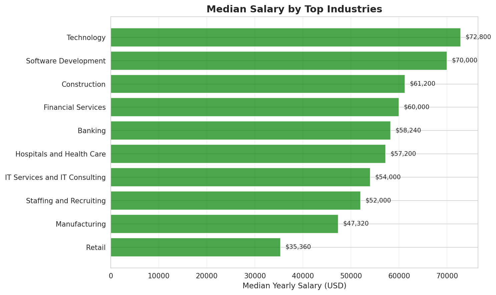
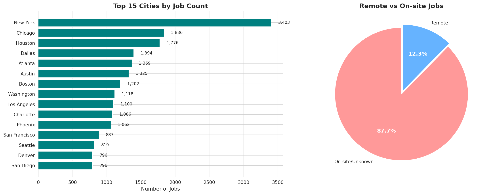
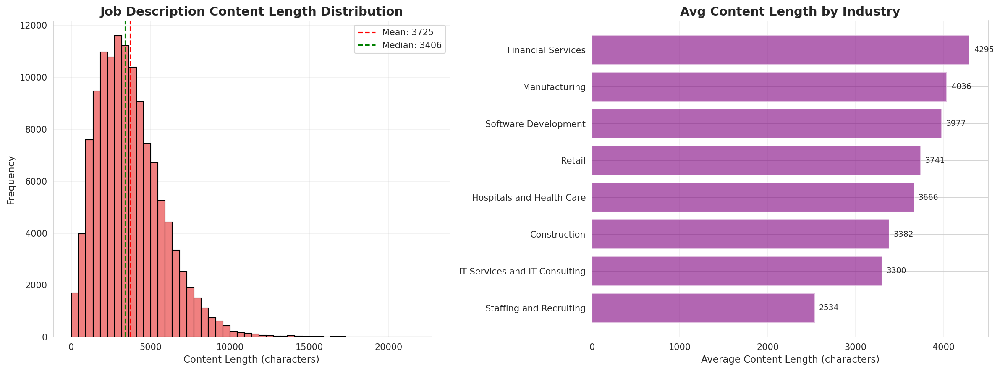
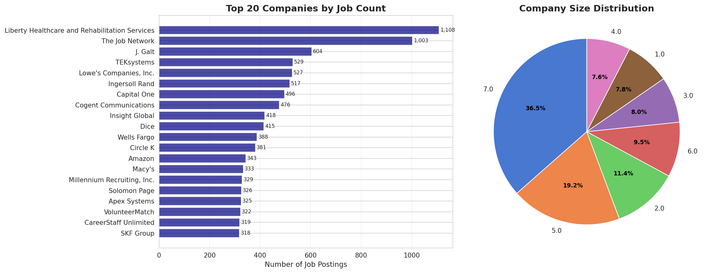
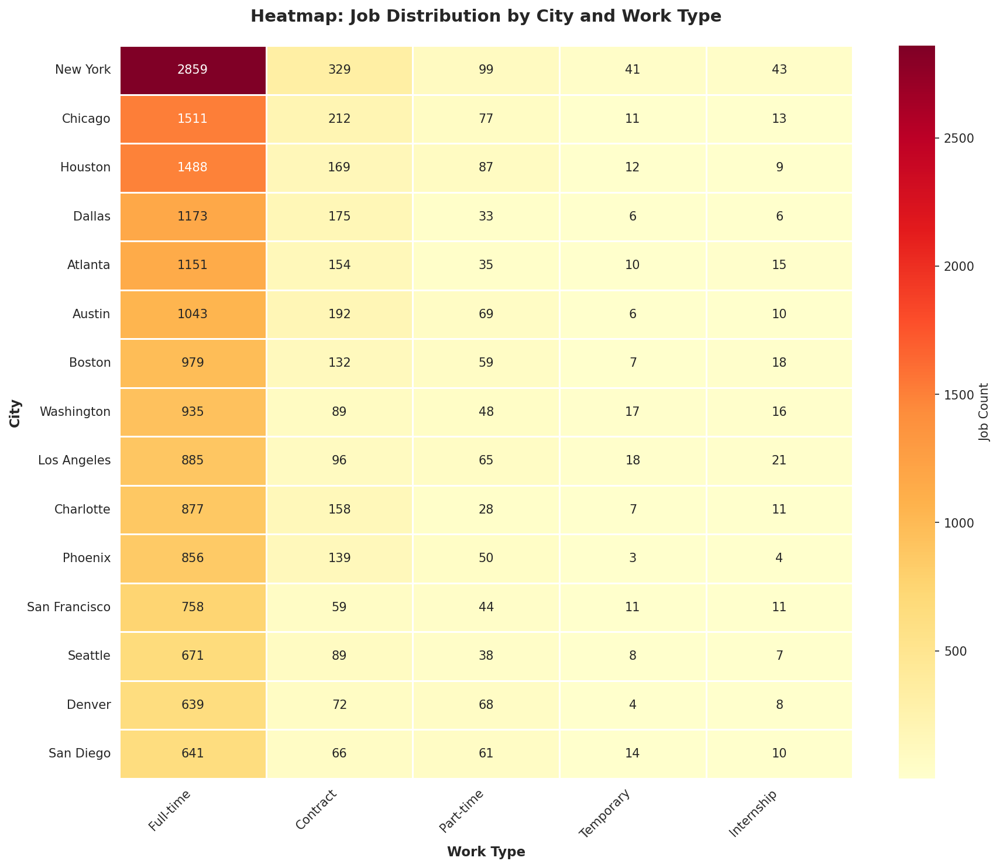

# Data Exploration Report: LinkedIn Job Postings

**Analysis Date**: 2025-12-28

**Dataset Size**: 123,842 job postings

---

## Executive Summary

This report analyzes 123,842 LinkedIn job postings to inform the design of a content-based recommendation system.
Key findings highlight skill demand patterns, salary distributions, industry concentrations, and geographic trends.

## 1. Skills Landscape

- **Total Unique Skills**: 35 distinct skill categories
- **Jobs with Skills Data**: 122,090 (98.6%)
- **Top 5 In-Demand Skills**: Information Technology, Sales, Management, Manufacturing, Health Care Provider
- **Total Skill Mentions**: 205,767 across all jobs

**Recommendation Insight**: Skills should be a primary feature in the recommendation system.
Consider weighting rare skills higher for niche matching.

## 2. Industry & Work Type Distribution

- **Top Industry**: Hospitals and Health Care (17,762 jobs, 14.3%)

- **Work Type Breakdown**: Full-time (79.8%), Contract (9.8%), Part-time (7.8%)
- **Remote Work**: 15,243 jobs (12.3%) allow remote

**Recommendation Insight**: Industry clustering can improve recommendation diversity.
Remote preference should be a strong filter option.

## 3. Salary Analysis

### Salary Distribution

### Salary by Work Type

### Salary by Industry

- **Median Salary**: $47,840

- **Salary Range (IQR)**: $32,500 - $69,575

- **Mean Salary**: $61,647

- **Highest Paying Industries**: Technology ($72,800), Software Development ($70,000), Construction ($61,200)

- **Jobs with Salary Data**: 6,280 (5.1%)

**Recommendation Insight**: Salary should be optional filter, not core similarity metric.
Low coverage (5.1%) - focus on content/skills instead.

## 4. Geographic Distribution

- **Top Location**: New York (3,403 jobs)

- **Top 5 Cities**: New York, Chicago (1,836), Houston (1,776), Dallas (1,394), Atlanta (1,369)
- **Location Coverage**: 89.2% of jobs have parsed city

- **Remote Jobs**: 15,243 allow remote work

**Recommendation Insight**: Location-based filtering useful but not critical for content similarity.

## 5. Content Quality

- **Description Length**: 3435 chars (median)
- **Mean Length**: 3766 chars
- **Content Completeness**: 100.0%

**Recommendation Insight**: Rich text content available for TF-IDF/embeddings.
Median ~3,400 chars provides strong signal for similarity matching.

## 6. Company Insights

- **Total Companies**: 24,468

- **Top Employers**: Liberty Healthcare (1,108 jobs), The Job Network (1,003 jobs), J. Galt (604 jobs)

- **Company Size**: Large companies (Size 7.0) dominate at 36.5%

**Recommendation Insight**: Company size can be secondary filter.
Consider diversity to avoid over-recommending from same employer.

## 7. Geographic Heatmap

- **Cities Analyzed**: Top 15 US cities

- **Work Types**: Full-time, Contract, Part-time, Temporary, Internship

- **Total Jobs**: 19,835 jobs in heatmap

**Key Patterns**:

- New York dominates with 2,859 full-time positions

- Full-time jobs heavily concentrated in major metros (NYC, Chicago, Houston)

- Contract work most common in NYC (329), Chicago (212), Dallas (175)

- Part-time opportunities relatively uniform across cities

- Temporary and internship positions rare across all locations

**Recommendation Insight**: Geographic distribution highly skewed to major metros. Location filter essential for users outside top cities. Full-time jobs 5-10x more common than other work types across all cities.

---

## Recommendations for Model Design

### Primary Features (Core Similarity)
1. **Skills** - High coverage (98.6%), strong discriminative power, 35 categories
2. **Job Description** - 100% coverage, rich semantic content (~3,400 chars median)
3. **Industry** - Good coverage (98.8%), domain clustering

### Secondary Features (Filters/Weights)
4. **Work Type** - User preference filter (Full-time vs Contract)
5. **Remote Allowed** - Critical filter for modern job seekers (12.3% remote)
6. **Location** - Optional geographic constraint (89.2% have city data)
7. **Salary Range** - Filter only (low coverage at 5.1%)

### Model Strategy
- **Content-Based**: TF-IDF or BERT embeddings on `clean_text`
- **Hybrid Approach**: Combine text similarity + skill overlap + industry matching
- **Diversity**: Penalize recommendations from same company/industry

### Evaluation Metrics
- Precision@K (K=5, 10, 20)
- Skill overlap percentage
- Industry diversity in top-K

### Data Quality Summary
- **Strengths**: 100% description coverage, 98.6% skills, 98.8% industries
- **Limitations**: Only 5.1% salary data, 10.8% missing location
- **Recommendation**: Focus on text+skills, use location/salary as optional filters

---

**Report Generated**: 2025-12-28 12:29:36.038031

**Visualizations**: 10 PNG files saved to images/ directory

- eda_skills_analysis.png - WordCloud + Top 20 skills

- eda_industry_worktype.png - Industries + Work type distribution

- eda_salary_distribution.png - Salary distribution histogram

- eda_salary_by_work_type.png - Salary by work type boxplot

- eda_salary_by_industry.png - Median salary by top industries

- eda_location_remote.png - Top cities + Remote distribution

- eda_content_analysis.png - Content length analysis

- eda_company_insights.png - Top employers + Size distribution

- eda_city_worktype_heatmap.png - City x Work Type heatmap

**Next Steps**: Proceed to Day 4 (Vectorization) with TF-IDF baseline + MiniLM comparison.