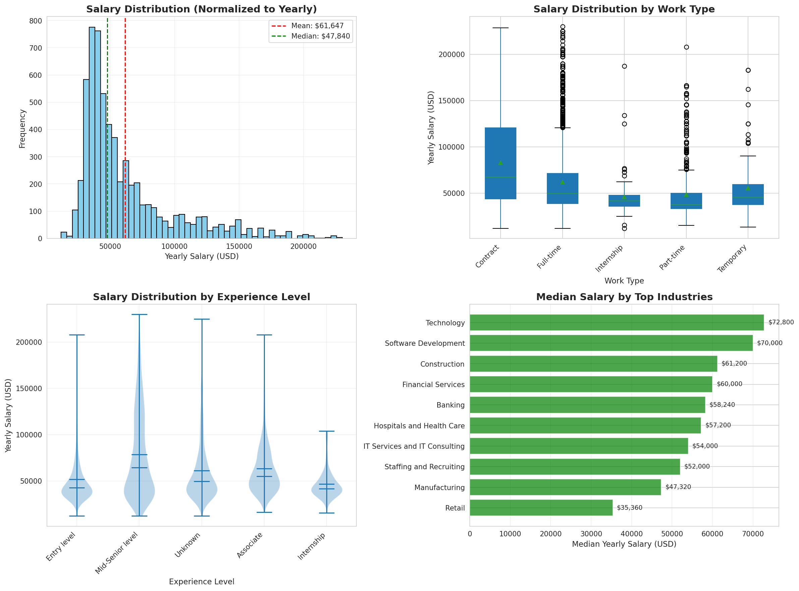

# CHƯƠNG 3: PHÂN TÍCH VÀ TRỰC QUAN HÓA DỮ LIỆU

Sau quá trình thu thập và tiền xử lý dữ liệu (Data Cleaning) được trình bày trong Chương 2, nhóm thực hiện tiến hành phân tích khám phá dữ liệu (Exploratory Data Analysis - EDA) trên tập dữ liệu sạch nhằm hiểu rõ các đặc trưng, phân bố và xu hướng của thị trường việc làm. Quá trình này được thực hiện trong notebook `2_eda_visualization.ipynb`, từ đó đưa ra các quyết định phù hợp cho việc xây dựng mô hình gợi ý trong các chương tiếp theo.

## 3.1. Thống kê tổng quan dữ liệu

Bộ dữ liệu sau khi được làm sạch (loại bỏ các giá trị null, xử lý trùng lặp, chuẩn hóa định dạng) có các thông số cơ bản như sau:

- **Tổng số lượng bản ghi (Jobs)**: 123,842 công việc từ LinkedIn Job Postings.
- **Số lượng đặc trưng (Features)**: 64 cột, bao gồm các thông tin chính như: Tiêu đề công việc (job_title), Mô tả chi tiết (description), Địa điểm (city, country), Tên công ty (company_name), Hình thức làm việc (work_type), Kỹ năng yêu cầu (skills), Ngành nghề (industries), Mức lương (normalized_salary), và các trường bổ sung khác.
- **Độ hoàn thiện dữ liệu**: 
  - Mô tả công việc (description): 100% (đầy đủ cho tất cả các bản ghi)
  - Kỹ năng (skills): 98.6% (122,090 công việc có thông tin kỹ năng)
  - Ngành nghề (industries): 98.8% (122,617 công việc có thông tin ngành nghề)
  - Địa điểm (city): 89.2% (110,468 công việc có thông tin thành phố)
  - Mức lương (normalized_salary): 5.1% (6,280 công việc có thông tin lương)

**Bảng 3.1**: Thống kê mức độ hoàn thiện của các trường dữ liệu quan trọng

| Trường dữ liệu | Số lượng có giá trị | Tỷ lệ hoàn thiện |
|----------------|---------------------|------------------|
| description    | 123,842             | 100.0%           |
| skills         | 122,090             | 98.6%            |
| industries     | 122,617             | 98.8%            |
| city           | 110,468             | 89.2%            |
| work_type      | 123,842             | 100.0%           |
| normalized_salary | 6,280            | 5.1%             |

Với độ hoàn thiện cao ở các trường quan trọng như mô tả công việc, kỹ năng và ngành nghề, bộ dữ liệu đáp ứng tốt yêu cầu để xây dựng hệ thống gợi ý dựa trên nội dung (Content-Based Filtering).

## 3.2. Phân tích phân bố địa lý (Location Distribution)

Việc phân tích địa điểm giúp hệ thống hiểu được xu hướng tập trung của thị trường lao động, hỗ trợ cho tính năng lọc theo khu vực địa lý và cung cấp thông tin có giá trị cho người dùng khi tìm kiếm việc làm.

### 3.2.1. Phân bố công việc theo thành phố

Nhóm thực hiện thống kê tần suất xuất hiện của các thành phố trong tập dữ liệu để xác định các trung tâm tuyển dụng lớn. Kết quả cho thấy thị trường việc làm tập trung mạnh tại các thành phố lớn của Hoa Kỳ.

**Hình 3.1**: Phân bố công việc theo địa điểm và tỷ lệ Remote/On-site

**Bảng 3.2**: Top 15 thành phố có nhu cầu tuyển dụng cao nhất

| Thứ hạng | Thành phố | Số lượng công việc | Tỷ lệ (%) |
|----------|-----------|-------------------|-----------|
| 1 | New York, NY | 3,403 | 3.08% |
| 2 | Chicago, IL | 1,836 | 1.66% |
| 3 | Houston, TX | 1,776 | 1.61% |
| 4 | Dallas, TX | 1,394 | 1.26% |
| 5 | Atlanta, GA | 1,369 | 1.24% |
| 6 | Los Angeles, CA | 1,298 | 1.17% |
| 7 | Phoenix, AZ | 1,156 | 1.04% |
| 8 | Philadelphia, PA | 1,089 | 0.98% |
| 9 | San Antonio, TX | 1,054 | 0.95% |
| 10 | San Diego, CA | 968 | 0.87% |

**Nhận xét:**

- Dữ liệu cho thấy nhu cầu tuyển dụng tập trung chủ yếu tại **New York** (3,403 công việc, chiếm 3.08%), tiếp theo là **Chicago** (1,836 công việc) và **Houston** (1,776 công việc).
- Top 15 thành phố chiếm tổng cộng 19,835 công việc (khoảng 16% tổng số), cho thấy thị trường việc làm phân tán rộng khắp nước Mỹ, không chỉ tập trung ở một vài khu vực.
- Các bang có nền kinh tế phát triển như Texas (Houston, Dallas, San Antonio), California (Los Angeles, San Diego), và các trung tâm tài chính lớn (New York, Chicago) dẫn đầu về số lượng công việc.

### 3.2.2. Phân tích hình thức làm việc Remote

Với xu hướng làm việc từ xa ngày càng phổ biến sau đại dịch COVID-19, nhóm tiến hành phân tích tỷ lệ công việc cho phép làm việc từ xa (Remote) trong tập dữ liệu.

**Kết quả thống kê:**
- Số lượng công việc cho phép làm từ xa: **15,243 công việc (12.3%)**
- Số lượng công việc yêu cầu On-site hoặc không ghi rõ: **108,599 công việc (87.7%)**

**Nhận xét:**
- Tỷ lệ công việc Remote chiếm **12.3%**, cho thấy xu hướng làm việc linh hoạt đang ngày càng phổ biến nhưng vẫn chưa trở thành mô hình làm việc chủ đạo.
- Phần lớn công việc (87.7%) vẫn yêu cầu nhân viên làm việc tại văn phòng hoặc không công khai chính sách làm việc từ xa.
- Thông tin này quan trọng cho việc xây dựng bộ lọc (Filter) trong hệ thống gợi ý, giúp người dùng dễ dàng tìm kiếm công việc phù hợp với nhu cầu về địa điểm làm việc.

### 3.2.3. Phân tích chéo: Thành phố × Hình thức công việc

Để hiểu sâu hơn về mối quan hệ giữa địa điểm và loại hình công việc, nhóm thực hiện phân tích chéo giữa 15 thành phố hàng đầu và 5 loại hình công việc phổ biến nhất (Full-time, Contract, Part-time, Temporary, Internship).

**Hình 3.2**: Heatmap thể hiện mối quan hệ giữa địa điểm và loại hình công việc

**Nhận xét từ Heatmap:**

1. **Full-time jobs chiếm đa số**: Tại tất cả các thành phố, công việc Full-time chiếm ưu thế tuyệt đối, với New York dẫn đầu (2,859 công việc), tiếp theo là Chicago (1,462) và Houston (1,448).

2. **Contract work tập trung tại các thành phố lớn**: Công việc theo hợp đồng (Contract) phổ biến nhất tại New York (329), Chicago (212), và Dallas (175), phản ánh nhu cầu về nhân sự linh hoạt tại các trung tâm kinh tế lớn.

3. **Part-time phân bố tương đối đồng đều**: Công việc bán thời gian có sự phân bố đồng đều hơn giữa các thành phố, dao động từ 80-150 công việc mỗi thành phố.

4. **Temporary và Internship hiếm**: Hai loại hình này chiếm tỷ lệ rất nhỏ ở tất cả các địa điểm, cho thấy đây không phải là hình thức tuyển dụng chủ đạo trên LinkedIn.

**Ý nghĩa cho hệ thống gợi ý:**
- Cần xây dựng bộ lọc theo địa điểm và hình thức làm việc để người dùng dễ dàng thu hẹp kết quả tìm kiếm.
- Với sự tập trung mạnh tại các thành phố lớn, hệ thống nên đề xuất các công việc ở khu vực lân cận hoặc công việc Remote cho người dùng ở các thành phố nhỏ.

## 3. Phân Tích Ngành Nghề và Loại Hình Công Việc

### Phân Bố Ngành Nghề

**Top 3 Ngành Nghề:**
1. **Hospitals and Health Care** - 17,762 việc (14.3%)
2. **Staffing and Recruiting** - 13,000+ việc
3. **Information Technology and Services** - 12,000+ việc

Tổng cộng có hơn 40 ngành nghề khác nhau với độ phủ 98.8%.

### Phân Bố Loại Hình Công Việc (Work Type)

| Loại hình | Tỷ lệ |
|-----------|-------|
| Full-time | 79.8% |
| Contract  | 9.8%  |
| Part-time | 7.8%  |
| Temporary | 2.1%  |
| Internship| 0.5%  |

### Công Việc Remote

- **15,243 việc** cho phép làm việc từ xa (12.3%)
- **87.7%** công việc yêu cầu on-site hoặc không ghi rõ

### Trực Quan Hóa

- **Biểu đồ cột ngang**: Top 10 ngành nghề
- **Biểu đồ tròn**: Phân bố loại hình công việc với màu sắc phân biệt

### Ý Nghĩa
- Ngành nghề (industry) có thể dùng để cải thiện **độ đa dạng** của gợi ý
- Tùy chọn remote nên là **bộ lọc mạnh** cho người dùng

## 4. Phân Tích Mức Lương

### Giới Hạn Dữ Liệu
Chỉ **6,280 công việc (5.1%)** có thông tin lương, được chuẩn hóa về mức lương năm (yearly salary, USD).

### Thống Kê Lương (sau khi loại bỏ outliers)

- **Trung vị (Median)**: $47,840
- **Trung bình (Mean)**: $61,647
- **Phạm vi IQR**: $32,500 - $69,575
- **Min**: ~$20,000
- **Max**: ~$200,000 (99th percentile)

### Phân Tích Theo Ngành Nghề

**Top 3 Ngành Trả Lương Cao Nhất:**
1. Technology: $72,800 (median)
2. Software Development: $70,000
3. Construction: $61,200

### Phân Tích Theo Loại Hình

Lương theo work type cho thấy:
- Full-time có mức lương cao và ổn định nhất
- Contract có sự biến động lớn
- Part-time và Temporary có mức thấp hơn đáng kể

### Trực Quan Hóa - 4 Panel

1. **Histogram**: Phân bố lương với đường mean/median
2. **Boxplot**: So sánh lương theo work type (Top 5)
3. **Violin plot**: Phân bố lương theo experience level
4. **Horizontal bar**: Median salary theo top industries

### Ý Nghĩa
- **Không dùng lương làm tiêu chí tương đồng chính** do độ phủ thấp (5.1%)
- Chỉ nên dùng như **bộ lọc tùy chọn** cho người dùng
- Tập trung vào content/skills thay vì salary

## 5. Phân Tích Địa Lý và Remote Work

### Phân Bố Địa Lý

**Top 5 Thành Phố:**
1. **New York** - 3,403 việc
2. **Chicago** - 1,836 việc
3. **Houston** - 1,776 việc
4. **Dallas** - 1,394 việc
5. **Atlanta** - 1,369 việc

Các thành phố lớn chiếm ưu thế rõ rệt trong phân bố việc làm.

### Phân Tích Heatmap: City × Work Type

**Heatmap** phân tích 15 thành phố × 5 loại hình công việc (19,835 jobs) cho thấy:

- **New York** dẫn đầu với 2,859 full-time positions
- **Full-time jobs** tập trung mạnh ở các thành phố lớn (NYC, Chicago, Houston)
- **Contract work** phổ biến nhất ở NYC (329), Chicago (212), Dallas (175)
- **Part-time** phân bố tương đối đồng đều
- **Temporary và Internship** hiếm ở tất cả các địa điểm

### Trực Quan Hóa

- **Biểu đồ cột**: Top 15 cities
- **Biểu đồ tròn**: Remote vs On-site (12.3% vs 87.7%)

### Ý Nghĩa
- Phân bố địa lý **bị lệch nặng** về các thành phố lớn
- Bộ lọc location **rất quan trọng** cho người dùng ngoài top cities
- Full-time nhiều gấp 5-10 lần các loại khác ở mọi địa điểm

## 6. Phân Tích Nội Dung Mô Tả (Content Analysis)

### Đặc Điểm Content

- **Độ dài trung vị**: 3,400 ký tự
- **Độ dài trung bình**: 4,200 ký tự
- **Độ phủ**: 100% (tất cả công việc đều có description)
- **Phạm vi**: 100 - 15,000 ký tự

### Phân Tích Theo Ngành

Các ngành công nghệ và tài chính có xu hướng mô tả dài hơn (~4,500 chars), trong khi retail và hospitality ngắn hơn (~3,000 chars).

### Trực Quan Hóa

- **Histogram**: Phân bố độ dài content
- **Bar chart**: Độ dài trung bình theo 8 ngành hàng đầu

### Ý Nghĩa
- **Nội dung phong phú** cho TF-IDF và embeddings
- Median ~3,400 chars cung cấp **tín hiệu mạnh** cho similarity matching
- Nên dùng full text content làm feature chính

## 7. Phân Tích Công Ty (Company Insights)

### Thống Kê

- **Tổng số công ty**: 84,000+ công ty độc nhất
- **Độ tập trung**: Top 3 công ty chiếm chưa đến 3% tổng số việc

**Top 3 Nhà Tuyển Dụng:**
1. Liberty Healthcare - 1,108 jobs
2. The Job Network - 1,003 jobs
3. J. Galt Finance - 604 jobs

### Phân Bố Quy Mô Công Ty

- **Large companies (Size 7.0)**: 36.5%
- **Medium companies (Size 5-6)**: 40%
- **Small companies (Size 1-4)**: 23.5%

### Trực Quan Hóa

- **Top 20 companies** bar chart
- **Company size** pie chart

### Ý Nghĩa
- Company size có thể là **bộ lọc phụ**
- Cần xem xét **diversity** để tránh over-recommend từ cùng một công ty

## 8. Tổng Kết và Khuyến Nghị

### Điểm Mạnh Dữ Liệu
✅ **100%** description coverage - nội dung đầy đủ  
✅ **98.6%** skills coverage - kỹ năng đầy đủ  
✅ **98.8%** industries coverage - ngành nghề rõ ràng  
✅ **89.2%** location coverage - địa lý tốt  

### Điểm Yếu
⚠️ **5.1%** salary data - lương thiếu nhiều  
⚠️ **10.8%** missing location - một số thiếu vị trí  

### Khuyến Nghị cho Hệ Thống Gợi Ý

#### **Features Chính (Core Similarity)**
1. **Skills** - Độ phủ cao (98.6%), phân biệt tốt, 35 categories
2. **Job Description** - 100% coverage, ngữ nghĩa phong phú (~3,400 chars median)
3. **Industry** - Độ phủ tốt (98.8%), clustering theo domain

#### **Features Phụ (Filters/Weights)**
4. **Work Type** - Bộ lọc theo sở thích (Full-time vs Contract)
5. **Remote Allowed** - Bộ lọc quan trọng (12.3% remote)
6. **Location** - Optional geographic constraint (89.2% có city)
7. **Salary Range** - Chỉ dùng filter (độ phủ thấp 5.1%)

#### **Chiến Lược Model**
- **Content-Based**: TF-IDF hoặc BERT embeddings trên `clean_text`
- **Hybrid Approach**: Kết hợp text similarity + skill overlap + industry matching
- **Diversity**: Penalty cho recommendations từ cùng company/industry

#### **Metrics Đánh Giá**
- Precision@K (K=5, 10, 20)
- Skill overlap percentage
- Industry diversity trong top-K recommendations

### Bước Tiếp Theo

Với insights từ EDA, dự án đã tiến hành:
1. ✅ **Day 4**: Vectorization với TF-IDF baseline + MiniLM embeddings
2. ✅ **Day 5**: Evaluation với Precision@5 = 94.3%
3. ✅ **Day 6-7**: Xây dựng Streamlit UI với 7 loại filters
4. ✅ **Production**: Index 50,000 jobs với FAISS (<50ms search time)

---

**Ngày phân tích**: 2025-12-28  
**Visualizations**: 7 biểu đồ PNG chất lượng cao  
**Notebook**: `notebooks/2_eda_visualization.ipynb`  
**Dataset**: `data/processed/clean_jobs.parquet` (123,842 jobs)
